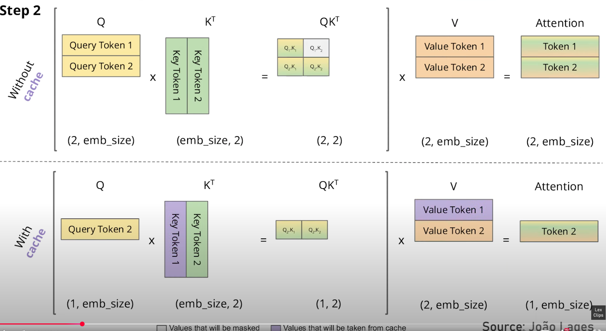
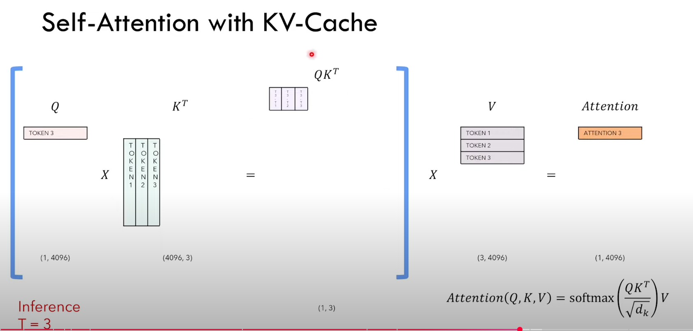

# Important: KV-Caching is an Inference time technique ONLY
# Relates to time to first token (TFTT) - No KV cache for the first token, higher latency. Later tokens have KV cache, lower latency.
- Input X can be [BOS] token (one token) or a sequence of N tokens (multiple tokens) - more common, as typically we have an input prompt and want to generate a response.
    - Recall: The K,V we are referring to here are the projected vectors (the outputs K=Wk.x and V=Wv.x) - not the weight matrices (Wk and Wv).
        - X here is a flattened sequence of tokens with Batch and Channel dimensions. 
    - Core Concept: K,V are dependent on X; at each time step, when predicting a new token, we need the K,V values of previous tokens with respect to the current Query Token
    - Because X is "flattened" (batch, channel, seq_len) K,V are sequentially depedendent (imagine how X is incrementally extended as each new token is added).
        - at T=2 (existing KV-cache values), the "streteched out" X sequence contains the token(s) before T=1 and the newly predicted token at T=1. So the K,V matrices that need to be computed are a super set of the previous K,V matrices (which we stored in the KV-cache).
        - that's it. There is no shared "attention" between previous tokens and the new token at T=2. Only sharing of KV values based on the mechanics of how K,V is built before the attention scoring.

# Fundamental Concept:
- the mechanism which allows Transformers to not just independently look at each token, but consider all previous tokens is the keys and values.
- at the current token, we present a query (the current token we are predicting from), and all the keys and values of the previous tokens.
- if we cache the keys and values of the previous tokens, we can just present the new query token, no need to pass the entire sequence of input tokens to the model. 
    - visualize a flattened/streteched out X sequence with tokens at T=1 and T=2. At T=2, the MatMul of X with Wk and Wv to get K,V values (for attention scoring) has K,V values that were already computed at T=1. 
    - Which is why, we only need to take the new Query token output (just predicted at T=now-1), with the "new" key token output appended with the K-cache (and V-cache) to compute the new attention scores.

# Without KV-Cache, we pass all preceding tokens as Input Query Tokens. By MatMul mechanics, this re-computes the same computations we would have performed when calculating attention scores for historical tokens which is wasteful.

# The insight is the Key and Value Weight Matrices (Wk and Wv) remain unchanged throughout the Inference process; So we can cache the projected vectors (the outputs K=Wk.x and V=Wv.x) of previous tokens relevant for prediction of the next token.

# K-V Cache takes up majority of memory at inference time, for 30B OPT model, 3x the memory as the model weights.
Example:
2 Matrices (K and V) * precision of weights (typically FP16 for inference) * nLayers * dmodel * seq_len/Block_size * batch_size

for 30B OPT Model KV Cache Memory:
2 * 2 Bytes * 48 Layers * 7168 dims * 1024 seq_len * 128 batch_size = 180GB

Weights:
2 Bytes * 30B Parameters = 60GB