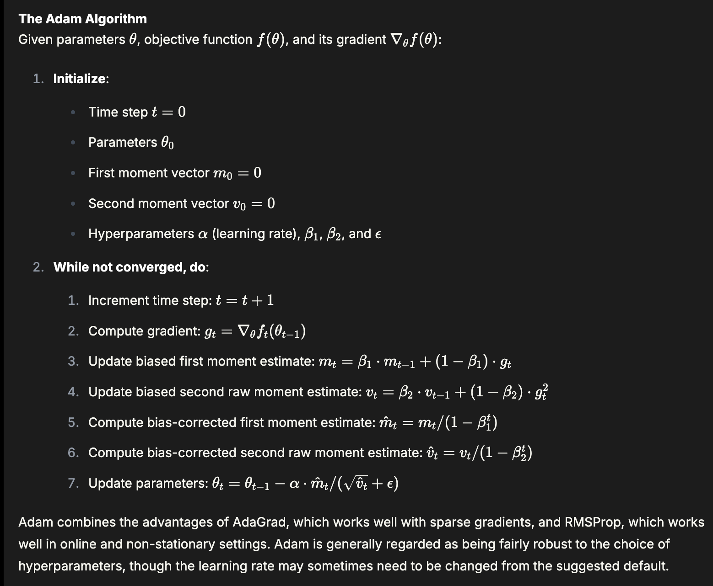

PyTorch Round 1:

Functions:
- get_random_batch
    - estimate train/val loss based on batch

1. Attention Block
    - Quadratic Problem
    - Long Context Problem
    - [Masked/Causal](https://www.deep-ml.com/problems/107)
    - [Sliding Window](https://leetgpu.com/challenges/sliding-window-self-attention)
        - Mask requires distance between tokens to operationalize the "sliding window"
        ```python
        idx = torch.arange(M, device=device)
        mask = (idx[None,:] - idx[:,None]) > Window_Size # for casual LLM. For bidirectional, add a .abs(); window >= 2 obvious
        # now at token 5, if Window_Size = 2, then token 5 can attend to token 3 and 4 (and itself), but not token 0,1,2
        ```
    - Flash Attention
    - [Multi-Head Attention](https://leetgpu.com/challenges/multi-head-attention)
        - Don't be afraid to append tensors into an array and torch.cat them later!
            - Mindful of 2D or 3D, we are always CONCAT along the channels dimension (usually dim=-1)
        - n_dim = num_heads * head_size (Then head_size is determined last after n_dim and num_heads, by dividing n_dim by the number of heads)
    -Positional Encoding
        - Sin/Cos, RoPe Learned [Positional Encoding](positional_encodings.py)
        - [ALiBi](https://leetgpu.com/challenges/attention-with-linear-biases)
    - [KV Cache Mechanics](https://www.deep-ml.com/deep-0/qg_107)
    - Residual Connections: Add the input to the output of the attention block (x = x + MHA(x); x = x + FFN(x))
        - The projection layer and residual connection work together but serve different purposes - the projection transforms the representation while the residual connection helps with gradient flow and feature preservation.
        - [FFN with Residual and Dropout](https://www.deep-ml.com/problems/178)
            - Be clear to ask if 1) Residual connection BEFORE or AFTER dropout; 2) torch.round(x, decimals=4) OK or use torch.round(out * 10000) / 10000
            - The trick is to save ```residual = x``` in the first line before any computations are done
        - [Dropout Forward + Backward Pass Implementation](https://www.deep-ml.com/problems/151)
            Forward Pass:
                ```python
                if not training: return x
                mask = np.random.binomial(1, 1-p, size=x.shape) -> implicitly zeros out with probability p
                x = x * mask / (1-p) # Normalization scaling factor, "inverted dropout"
                ```
                PyTorch:
                ```python
                if not training: return x
                mask = torch.bernoulli(torch.ones(x.shape) * (1-p))
                x = x * mask / (1-p)
                ```
            Backward Pass:
                ```python
                dx = out.grad * mask / (1-p) -> because FP we multiply this to x
                ```
    - Activation Functions: 
        - SwiGLU
            ```python
            x1, x2 = input[:N//2], input[N//2:] # splits the input into two halves
            s1 = x1 * torch.sigmoid(x1)
            output = torch.mul(s1, x2, out=output)
            ```
    - Dropout Layers (FP + BP)
    - [**Single Neuron Forward + Backward Pass Implementation**](https://www.deep-ml.com/problems/25)
    - [FFN Forward + Backward Pass Implementation](https://www.deep-ml.com/problems/40)
        - **F.linear() is a low level function, differing from nn.Linear(); so we need to transpose the weight matrix manually when applying F.linear(X, W.t(), b) because F.linear() does not transpose the weight matrix for us.
            - in nn.Linear(), the weights are naturally stored in transposed form - somehow generalizes downstream even though we will define them as nn.Linear(in_features, out_features) in the forward pass
2. SoftMax
    - Know how to compute Forward and Backward Pass from scratch (see CEL Makemore) - know sum over which dim
    - Happens in:
        a) CEL: F.cross_entropy(logits, targets)
            - sum over vocab dim (classes), not time. dim=1 for B,T,C
        b) Attention Block: wei = F.softmax(wei, dim=-1)  # (B, T, T)
            - sum over keys dim, which is the last dim (recall what Q.K.T outputs -> the keys to attend to)
        c) Generation/Sampling: F.softmax(logits, dim=-1) (B, C); idx_next = torch.multinomial(probs, num_samples=1) (B, 1)
            - sum over vocab dim since logits shape (B, vocab_size)
3. Cross Entropy Loss/NLL
    - Cross Entropy Loss is essentially: -log(softmax(logits))[correct_indices].mean()
    - Perplexity is just e^CELoss
    - Clipping: torch.clip(probabilities, min=epsilon, max=1.0) to avoid log(0)
    - When given logits:
    ```python
        logits_maxes = logits.max(dim=1, keepdim=True).values 
        norm_logits = logits - logits_maxes 
        counts = norm_logits.exp()
        counts_sum = counts.sum(dim=1, keepdims=True)
        counts_sum_inv = counts_sum**-1 
        probs = counts * counts_sum_inv
        logprobs = probs.log()
        loss = -logprobs[range(batch_size), Yb].mean()
    ```
    - When given probabilities:
    ```python
        clipped_prob = torch.clip(probabilities, min=epsilon, max=1.0)
        loss = -torch.log(clipped_prob[range(batch_size), Yb]).mean()
    ```
3. *Normalizations*: LayerNorm (Pre/Post) v.s BatchNorm v.s RMSNorm
    - [RMSNorm](https://leetgpu.com/challenges/rms-normalization)
        - The RMS elem is a torch.sqrt(1/N * torch.sum(input**2 + eps)) -> sqrt average of the sum
    - BatchNorm for 2D tensor (B,C) input tensor; for large batch sizes >= 32, CV CNNs; Normalize ↓
    ```python
        mean_t = torch.mean(input, dim=0, keepdim=True) # Batch Dim is 0
        sigma2_t = torch.pow(input - mean_t, 2).mean()
        x_norm_t = (input - mean_t) / torch.sqrt(sigma2_t + epsilon)
        return output.copy_(gamma * x_norm_t + beta)
    ```
    - LayerNorm for 2D tensor (B,T,C) input tensor; NLP, different sample have different distributions, same behavior in training and inference; Normalize →
    ```python
        mean_t = torch.mean(input, dim=-1, keepdim=True)
        sigma2_t = torch.var(input, dim=-1, keepdim=True, unbiased=True) # Kaparthy and Bessel's Correction are unbiased!!!
        x_norm_t = (input - mean_t) / torch.sqrt(sigma2_t + epsilon)
        return output.copy_(x_norm_t)
    ```
    - Layer/BatchNorm1D -> Sequences or 0D (B,C); BatchNorm2D -> Images; BatchNorm3D -> Videos
    - If asked to BatchNorm over Batch and Spatial Dimensions for 4D Tensor (B,C,H,W):
        ```python
            mean_t = input.mean(dim=(0,2,3), keepdim=True)
            sigma2_t = input.var(dim=(0,2,3), keepdim=True, unbiased=True)
            x_norm_t = (input - mean_t) / torch.sqrt(sigma2_t + epsilon)
            return output.copy_(gamma * x_norm_t + beta)
        ```
        - equivalent to: output_builtin = nn.BatchNorm2d(x)
4. *Optimizers*: AdamW, RMSProp, SGD, AdaGrad, AdaDelta, Adam, etc.
    - [Adam](https://www.deep-ml.com/problems/49) 
        - trick is to initialize torch.zeros(params.shape) and then add the gradients to it;
            - remember optimizer time step component is included
4. BackProp (Addition, Multiplication, Subtraction)
    - Goal is to compute grad_input using grad_output (grad accum from previous layer) and local derivative of the operation
    - Common activation functions (ReLU, Sigmoid, Tanh, SwiGLU, SILU) derivatives
    - [Single Neuron Backprop](https://www.deep-ml.com/problems/25)
5. CE/BCE Loss, MSE Loss
    - Manual backward pass and computing loss per epoch for a simple 2-Layer MLP
6. Count parameters in a 2-Layer MLP
    - for parameter in model.parameters(): total_params += parameter.numel()
7. Tokenization BPE
8. Transformers Vaswani Architecture (encoder-decoder architecture)
9. GPT2 Architecture (decoder-only architecture)
10. Broadcasting Rules for Tensors v.s Matrices
    - Tensor BT, alights right first, then "add ones" to the left of the smaller tensor or both(?), then BT over 1-dims ONLY
    - Matrix BT, aligns LEFT(?) first, BT over batch dims ONLY, and then check that matmul is valid with matching inner dims
        - For Matrice addition (elem-wise),  we can use tensor BT rules.
11. Dot Product v.s Matmul
12. Important Torch APIs:
    - torch.mean()
        - mean_t = torch.mean(input, dim=0, keepdim=True) -> Batch Norm for [B,C] input tensor
        - When averaging heads, keepdim=False (we want to squeeze):     return torch.mean(multi_head_output, dim=1, keepdim=False)
        - keepdim=True is an automatic unsqueeze(index_to_add_1dim); if no index provided, removes all size-1 dimensions
            - Important: squeeze only works on size-1 dimensions! nothing happens if squeeze a non-size-1 dimension
    - torch.round()
    - torch.exp()
    - torch.log()
    - torch.sqrt()
    - torch.pow()
        - BatchNorm Variance: sigma2_t = torch.pow(input - mean_t, 2).mean()
    - torch.mul()
    - torch.div()
    - torch.add()
    - torch.sub()
    - torch.matmul()
    - torch.tril()
    - torch.as_tensor()
    - torch.dot()
    - torch.where()
    - torch.sum()
        - in softmax: denom = torch.sum(exp, dim=1, keepdim=True) # shinks across T dim
    - torch.max()
        - in softmax: max_t = torch.max(input, dim=1, keepdim=True).values # shrink across dim
            - Returns keys values + indices
            - max/sum across the "Time/Sequence" dimension which is dim=1 for Batched Input (B,T,C) or dim=0 for non_batched input (rows, columns)
            - keepdim=True especially for downstream use!!!
    - torch.argmax()
    - torch.arange()
13. Important Torch Functions:
    - F.softmax()
14. The most difficult lines:
    ```python
    self.register_buffer("tril", torch.ones([block_size,block_size])) # causal attention mask
    torch.matrix_fill(self.tril[:T, :T] == 0, float("-inf")) # mask out the future tokens
    qk_t = Q @ K.transpose(-2, -1) * self.head_size**-0.5 # MHA attention denominator
    self.heads = nn.ModuleList(MHA(head_size) for _ in range(n_heads)) # multiple heads in parallel
    x = torch.cat([h(x) for x in self.heads], dim=-1) # merge the parallel computed heads 
    self.blocks = nn.Sequential(*[MHABlock(n_embd, n_heads) for _ in range(n_layer)]) # GPT multiple blocks
    ```
    -> remember in Attention there is a Dropout of scores BEFORE the Matmul with Values
    -> in MHA the channel dim is head_size
    -> no transpose of V when out @ V
    -> self.proj = nn.Linear(n_heads*head_size, n_embd) 
    -> self.token_embd = nn.Embedding(vocab_size, n_embd) # TODO input is vocab
    -> self.position_embd = nn.Embedding(block_size, n_embd) # input is ctx length
    -> pe = self.position_embd(torch.arange(T, device=device)) # just created new tensor move to GPU
    -> next_idx = torch.multinomial(proba, num_samples=1) # B, 1
    -> all keepdim=-1 except for generate()
    -> 3 Classes with Dropout (FFN, Head, MHA), 2 LayerNorms for Attention Block, 1 LayerNorm for GPTClass right after blocks before the LM Head
    -> Forward to calculate logits and loss; if no targets, loss = None;
    -> in GPT, reshape logits to (B*T, C) and targets to (B*T) for CE Loss (Requirement for F.cross_entropy())
    -> in generate(), we need proba from logits of final token via softmax, then sample from the distribution using multnomial sampling
    -> Layernorm in Attention Block is both Pre-Attention and Pre-FFN
    -> in Generate(), don't forget to get ix_cond = ix[:, -block_size:]

    ```python
    dw, db = torch.autograd.grad(
			outputs=out,
			inputs=[self.W, self.b],
			grad_outputs=accum_grad 
		)
    if self.trainable and self._opt:
			with torch.no_grad():
				self.W.copy_(self._opt.update(self.W,dw))
    ```
15. Useful Functions:
    - For processing data
    ```python
    def _to_tensor(x: torch.Tensor | np.ndarray) -> torch.Tensor:
        return x if isinstance(x, torch.Tensor) else torch.as_tensor(x, dtype=torch.float32)
    ```
# Advanced:
1. Vision Transformers
    - Why do we CONCAT the image embedding (CLS Embedding from ViT encoder) with the token embedding (from Decoder text backbone) 
        - Short Ans: Image is treated as separate token in the sequence. need to attend to it as a distinct element just like any other token
    - BUT add the positional embedding
        - Each token needs both content and position information in the same embedding. Addition merges them while keeping same dimensionality.
    - <image_pad> is a placeholder token for the image embedding. We eventually replace this with the actual image embedding (with same dimensionality as token embeddings)
        - BUT these image embeddings ARE NOT a distinct token in the text token vocabulary at all!
        - Marker tokens <vision_start> and <vision_end> are used to mark the start and end of the image embedding in the sequence and are in the token vocab
    - Number of <image_pad> tokens differs based on arch
        - Single CLS token, only accept single image -> Early CLIP-based models
        - Fixed multiple <image_pad> tokens, can accept single image. E.g. Llava-1.5 accept 336x336 image with each patch being 14x14 pixels
        - Dynamic Tokens depending on resolution -> # Low resolution (224×224): 256 tokens; # High resolution (448×448): 1024 tokens
        - Compressed Tokens (Learnable Reduction) -> BLIP-2 (Q-Former), compresses ViT output to fixed number like 32 compressed tokens always.
2. LoRa
    - [MSFT Implementation](https://github.com/microsoft/LoRA/blob/main/loralib/layers.py)
    - [TensorGym Easy Question](https://tensorgym.com/exercises/17)

3. MoE
    - [TopK](https://leetgpu.com/challenges/top-k-selection)