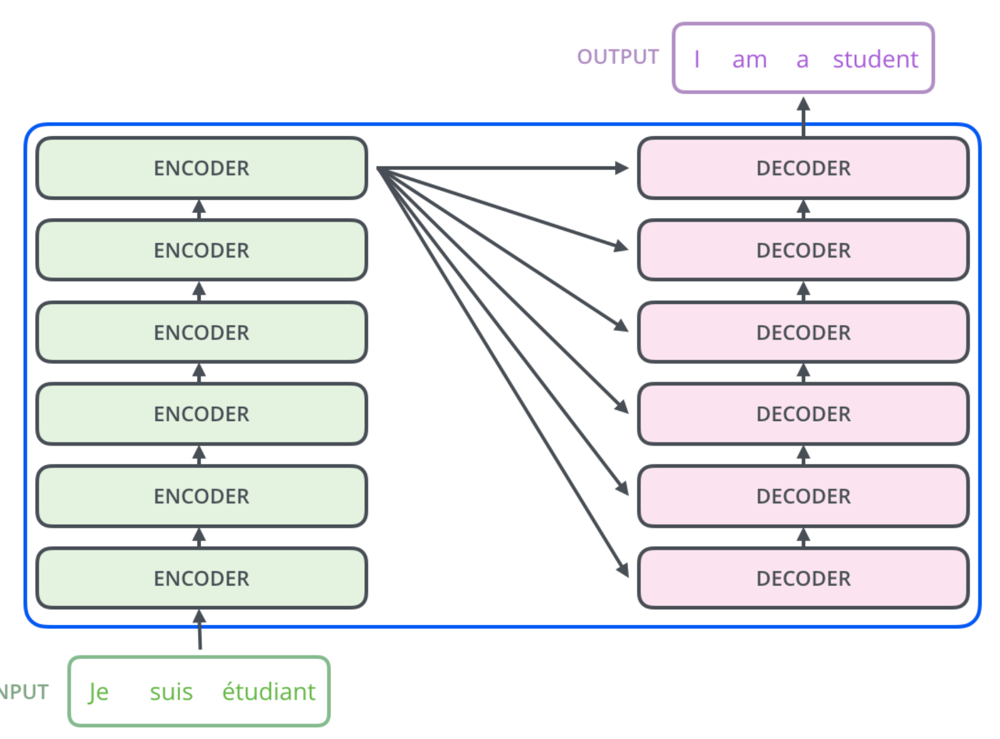
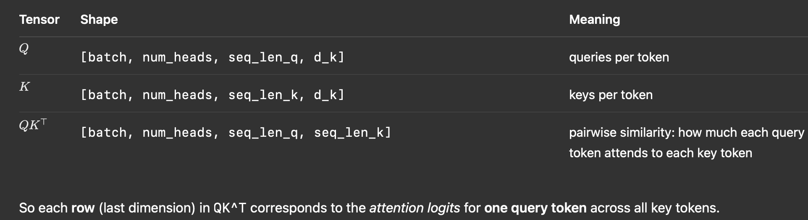
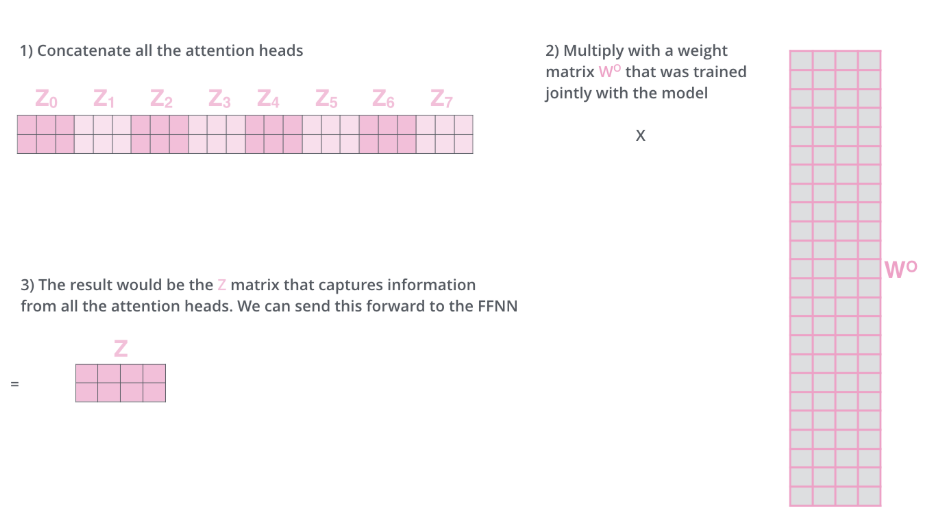

A Transformer takes as input a word, passes it through a stack of encoder blocks (6 or more sequentially). The final encoder block outputs to a stack of decoder blocks of the same number. The final decoder block outputs a word. 

# Token Embeddings
- Raw Text -> Tokenization -> Token IDs [101, 2023, 2088] (not embeddings)
- We MUST use the same tokenizer used in trainining for decoding! If BPE vocab of 30K used in training, using BPE vocab of 50K might use differeent merge rules and token IDs!!!
- TODO: Revisit BPE algo
every word -> single embedding through embd algorithm, each word is embedded into a vector of size 512 (or the length of the longest sentence in training data) - the "width" of training data representation
Word Embedding Algorithm used to convert words (text) from a Vocabulary to a corresponding vector of real numbers.
- instead of Bag Of Words (one-hot encoding) with high dimensionality, sparse vectors, ideally our WEA should have two advantageous properties:
    - Dimensionality reduction (efficient representation)
    - Contextual similarity (for semantic parsing - NLU) e.g. (King - Man + Woman = Queen, Word2Vec; Paris - France + Italy = Rome)
- Word2Vec implemented as Continuous Bag Of Words (CBOW) and Skip-Gram
    - 2-layer neural network, input_sz = output_sz = vocab_size (order of 10K, 100K); hidden_sz = embedding_sz (order of 300, 200, 100)
    - Hidden layer actually becomes the word embedding vector we use, and the num_neurons/features is a Hyperparameter we determine 
- Trained using hierarchical softmax (or negative sampling) to learn dense, low-dimensional word embeddings from the high dimensional, sparse one-hot encoded input vocab
- Once trained, the Word Embedding of a word is an O(1) operation on the embedding matrix
- to revisit math

# Bottom Most Encoder Block
- Token Embedding Algorithm #1: (seq_len, d_model) where seq_len is the length of the longest sentence in training data, d_model is the embedding dimension (original 512 for Vaswani 2017) - the "width" of training data
- Embedding v.s. Linear Transformations: embedding converts discrete tokens (words) into continuous vectors; linear transformations (W) can map these vectors to different spaces
- Abstraction common to all encoders is they receive a list of vectors of the size d_model (512 for Vaswani 2017) 

Encoders identical in containing self-attention layer and FFNN layer. Point of self-attention 

# Self-Attention Layer
1. After going through the embedding algorithm, the vectors approach the query, key, and value weight matrices that are created during training. *(Wq, Wk, Wv)*
 - This is where we take the *dot product of each word vector with the q, k, and v* weight matrices (Wq, Wk, Wv), Returning the vector projection of each word embedding into the query, key, and value spaces. (*qi, ki, vi*, where i is the word index corresponding to its embedding - every word gets its own query, key, and value vectors)

2. *Scaled Dot-Product Attention* "Score" and the "Quadratic Problem"
    - This determines how much attention to pay in the sentence with respect to this word itself and the other words in the sentence. (the "self" in self-attention)
    - Calculated by dot product of query and key vectors (qk), and scaled by dk**0.5 (for numerical stability)
    - Every word has a **score** with respect to itself and every other word in the sentence. (Hence *n-squared scores for a sentence of length n, and the quadratic problem*)
    - Note the difference in size of the embedding vector (usually 512) and the q/k/v vectors (usually 64)
    
    - (Why the softmax dim=-1?) The *result of q @ k^T* is a tensor of shape (batch, num_heads, seq_len_q, *seq_len_k*)
        - Queries represent "what context the word in question needs" and Keys represent "what context the word in question provides"
        - Hence we want a distribution of these "possible context words" summing to 1, and the softmax function, with *dim=-1* enables this, normalizing all possible keys for each query (recall attention scores are calculated with respect to the word itself and the other words in the sentence)

    3. *Multi-Head Attention* (multiple lenses the view the data)
        - Instead of single head attention, which might focus too much on one word, we "expand" and "diversify" the model's ability to focus on different positions by having multiple heads. 
        - Each head learns its own attention mechanism, ending up with Nh sets of encoder/decoder attention weights.
        - *SPDA* is computed independently for each head, resulting in Nh different Z matrices (qkv output)
        - output tensor shape [n_heads * (batch, seq_len_k, d_k)] where n_heads*d_k = d_model (recall d_k = d_model / n_heads in pre-attention input)
    
    4. *Concatenation and Projection using Wo*
        -  Since FFN is expecting a single vector input, we need to CONCAT the Nh of Z matrices, and "project" them with Wo, size (d_model, d_model)
            - The point of Wo is to learn "cross-head" mixing. After CONCAT, we do get (n,512) dim tensor (compatible with FFN input), but the 512 dims are *structurally seggregated*
            - "after we see data from multiple n-head lenses, we want to synthesize insights from every lens" 
            - Recall: The embedding algorith happens in the bottom-most encoder. The abstraction that is common to all the encoders is that they receive a list of vectors each of the size 512 – In the bottom encoder that would be the word embeddings, but in other encoders, it would be the output of the encoder that’s directly below. 
            The size of this list is hyperparameter we can set – basically it would be the length of the longest sentence in our training dataset.

        

5. *Positional Encoding*
    - Accounting for the order of words in the input sequence, not just semantics.
    - Not learned by the model in Vaswani 2017, but deterministic functions (since and cosine) that are added to the token embeddings. "Just" precomputed values that "account" for relative positions of words in the sequence.
    - Later, Learned Positional Encoding (BERT), Relative PE (T5, DeBERTa), Rotary Embeddings (RoPE)
        - RoPE does not add positional vector to embeddings pre-attention, instead inject position information directly into the attention score computation (To Revisit)

6. *Residual/Skip Connections*
    - Each encoder has a residular connection around it and followed by Layer-Norm.
    - the point is to allow gradients to "flow through" the addition operation back to earlier layers, and allow each layer to learn the delta (incremental change to apply) if it discovers something unique to modify

7. *Decoder Blocks*
- Final encoder block output transformed into a Key and Value used by each encoder-decoder attention (cross-attention) layer (shared) in the decoder blocks (Kencoder/decoder, Vencoder/decoder) instead of standalone KV weight matrices as in the encoder blocks. Each decoder block has its own Query weight matrix (Wq)
- Key distinction of decoder blocks:
    - Cross attention score in decoder blocks work by taking the encoder output (K, V) and dot product with the decoder block's Query (q) matrice (learned) to get the attention scores.
    - in the output of each step is fed to the bottom decoder in the next step (auto-regressive). Every time step, we feed in the new sequence (with just predicted token) to the bottom decoder to "bubble up" the decoder blocks and get the next predicted token
- Masking (during training) to only allow self-attention for past tokens (not future)

8. *Final Linear and Softmax Layer* (Language Modelling Head?)
- Learned matrice that projects the output of the decoder blocks (n,d_model) to (n,vocab_size) using a linear transformation (W_out), to produce the logits.
- Softmax applied to logits to get probabilities for each token in the vocabulary.